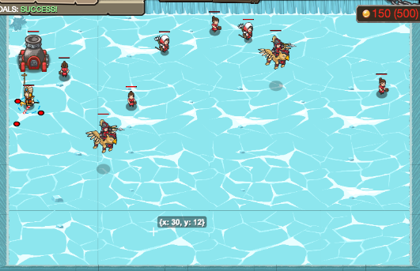

## _Coded Orders_

#### _Legend says:_
> Deployment orders are in! You need to decode the message, summon the troops, and place them at the given locations.

#### _Goals:_
+ _Place units according to orders._
+ _Bonus: place paladins and artillery._

#### _Topics:_
+ **Strings**
+ **Variables**
+ **Substring**
+ **Object Literals**
+ **Accessing Properties**
+ **Vectors**

#### _Solutions:_
+ **[JavaScript](codedOrders.js)**
+ **[Python](coded_orders.py)**

#### _Rewards:_
+ 1077-1608 xp
+ 322-481 gems

#### _Victory words:_
+ _SUBDUED SUBSTRINGS SUBTLY SUBMERGE IN YOUR SUBLIME SUBCONSCIOUS._

___

### _HINTS_

You have received a set of orders for the deployment of your troops.  You need to decode the message, summon the troops, and place them at the given locations.

Instructions are given in the form: `Txxyy`

Where T is one of the letters a, s, p, g, P, or A.  These letters stand for the types:
+ `"a"`: `"archer"`
+ `"s"`: `"soldier"`
+ `"p"`: `"peasant"`
+ `"g"`: `"griffin-rider"`
+ `"P"`: `"paladin"`
+ `"A"`: `"artillery"`

xx and yy are two digit numbers representing the x and y coordinate of the target for that unit.

You will need the Boss Star IV in order to summon and command all units, but you can complete the basic form of the level by only summoning the units on the Boss Star III.

___
