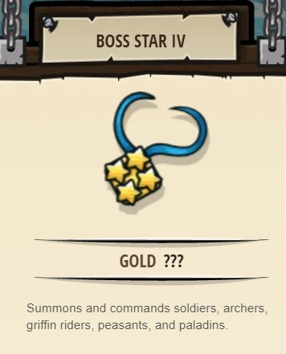

## _Kelvintaph Defiler_

#### _Legend says:_
> Warlocks have you trapped in a deadly antigravity ritual. Can you break free of their fell sorcery and finally loot the great treasure of Kelvintaph Tomb?

#### _Goals:_
+ _Eradicate the ogres_
+ _Your paladin must survive_
+ _Bonus: save all allies_

#### _Topics:_
+ **Strings**
+ **Variables**
+ **While Loops**
+ **If Statements**
+ **Functions**
+ **Arrays**

#### _Solutions:_
+ **[JavaScript](kelvintaphDefiler.js)**
+ **[Python](kelvintaph_defiler.py)**

#### _Rewards:_
+ 3070-4084 xp
+ 930-1236 gems
+ **Boss Star IV**

#### _Victory words:_
+ _YOU'VE STOLEN THE ICY HEART OF KELVINTAPH!_

___

### _HINTS_

_Super challenge level–bring your patience and craftiness!_

Kelvintaph Tomb, ever colder the deeper you go, now further shows off its hostility to you and your brave (frankly, suicidally so) squad. The dangers grow:
1. Your squad starts the level slipping on ice with no movement control.
2. Even if they did want to move, there are bear traps and a yeti _right there_.
3. There are strange, thin shamans casting perpetual _"fling"_, _"antigravity"_, and _"fear"_ spells to trap and disable each soldier and archer flung to them.
4. Even if, say, a single archer could somehow escape, what could she do against the munchkin, ogre, two throwers, and brawler who lurk in these cramped corridors?
5. Your paladin is being hurled into the clutches of the chaotic necromancer, Nalfar Cryptor, who will draining her life faster than she could hope to damage him by herself.
6. Meanwhile, your hero is beset back and front by robot walkers guarding the tomb.
7: Four warlocks are drawing your hero into a dark, sacrificial ritual–you cannot take even one visible action (anything besides `move` and `command`) without disrupting their concentration and drawing their anger.

This level is supposed to be very challenging. If you can figure out a working solution, congratulations–powerful spoils will be yours as you loot Kelvintaph Tomb's greatest treasure! Please keep your solution strategy a secret so as not to spoil the challenge for other players.

_**One tip**: shielding does defend against magic attacks._

Good luck!

___
