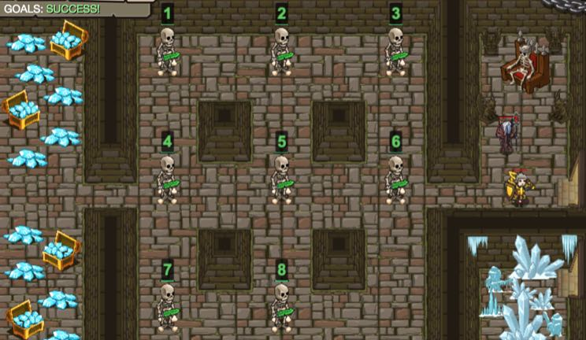

## _Skeleton Puzzle_

#### _Legend says:_
> If you don't have chips to play, then use skeletons.

#### _Goals:_
+ _Solve the skeleton puzzle_

#### _Topics:_
+ **Basic Syntax**

#### _Solutions:_
+ **[JavaScript](skeletonPuzzle.js)**
+ **[Python](skeleton_puzzle.py)**

#### _Rewards:_
+ 3070 xp
+ 930 gems

#### _Victory words:_
+ _IT LOOKS LIKE THE LAST THING YOU NEEDED WAS A SKELETON KEY!_

___

### _HINTS_

If you want to clear the path to treasures, then you should solve a puzzle. Form up skeletons in the order from 1 to 8 (left to right, up to down) as on the image:



Skeletons have names from `1` to `8`. They can move only to a free cell. Say a name (a number) and if it's possible the skeleton will move. You always can get the puzzle state from the necromancer with the method `getPuzzleState`.

```javascript
var necromancer = hero.findNearest(hero.findFriends());
var puzzleState = necromancer.getPuzzleState();
```

The `puzzle state` is represented as a 2-dimensional array with the size 3x3. The array contains numbers from `1` to `8` and `0`. Zero (`0`) is an empty cell. The top left cell is `puzzleState[0][0]`. The result state should be:

```javascript
[[1, 2, 3],
 [4, 5, 6],
 [7, 8, 0]]
```

___
